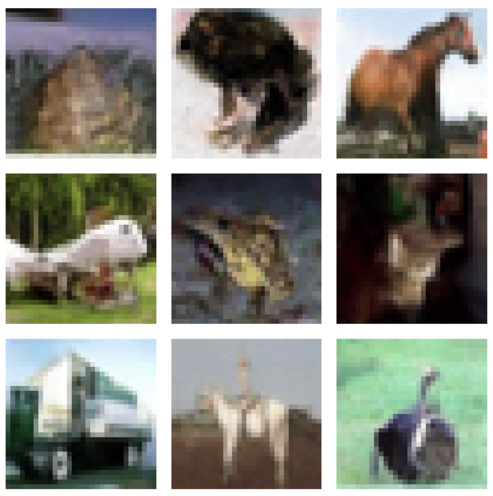
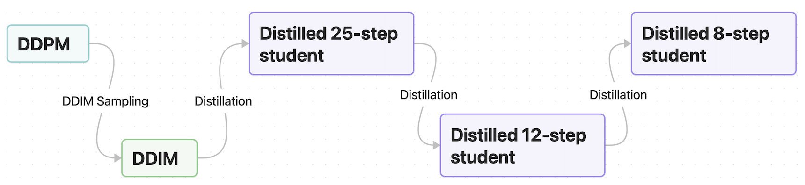
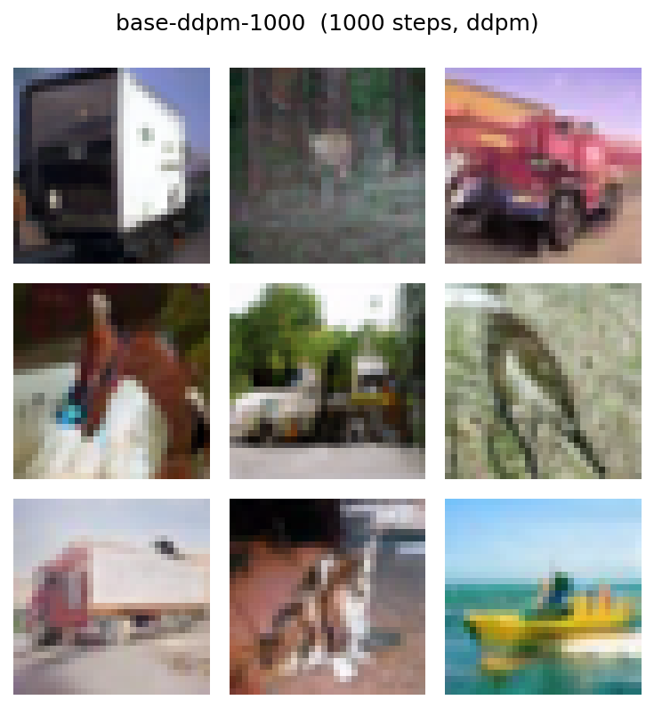
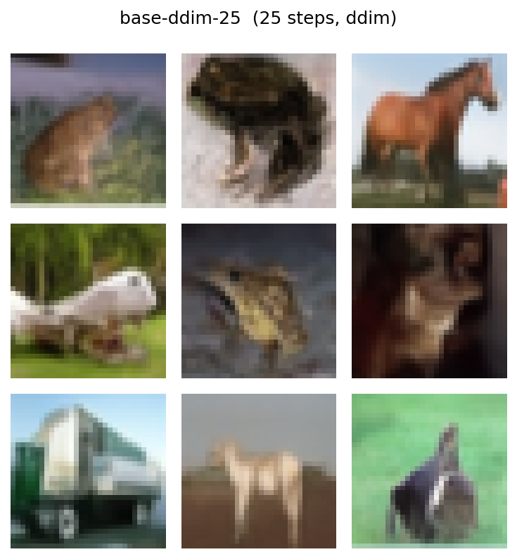
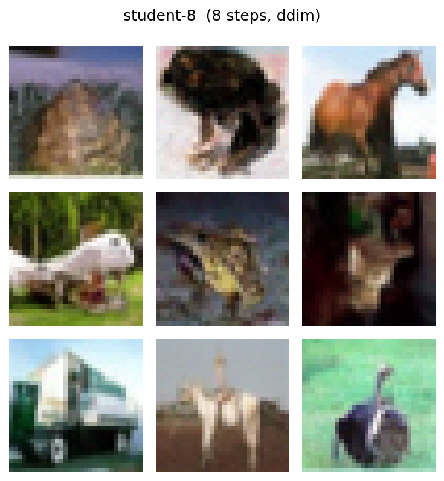
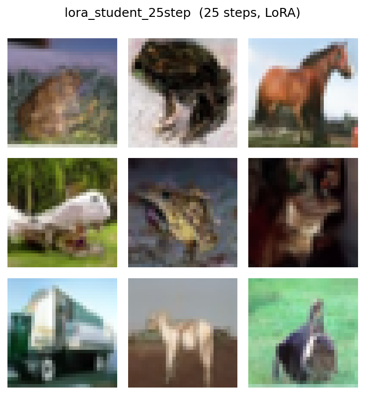
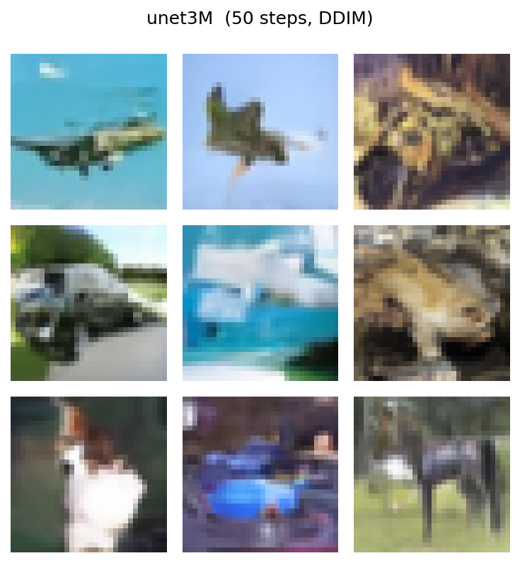
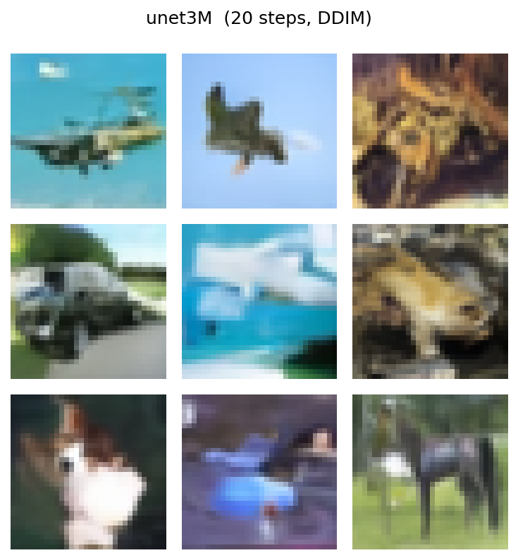

## Lightweight Diffusion Models  Accelerating Inference for Resource-Constrained Environments

  

  <em>Figure 1: CIFAR-10 samples generated by a distilled 8-step diffusion model.</em>

Denoising Diffusion Probabilistic Models (DDPMs) [3] achieve state-of-the-art results in image
generation, but their iterative sampling process is notoriously slow and computationally expensive.

This project investigates methods for accelerating inference in CIFAR-10 diffusion models while preserving generative quality. Specifically, we leverage Progressive Distillation to compress a multi-step teacher model into a few-step student. Beyond standard distillation, we explore performance optimization through Low-Rank Adaptation (LoRA) and evaluate low-precision inference via post-training quantization. Our best model achieves a 129× reduction in inference time, while only incurring a ~14% degradation in FID (≈ +1 point).

## Methodology

While multiple approaches have been tested, our primary line of work is built around Denoising Diffusion Implicit Models (DDIM) [2] and Progressive Distillation [1]. This methodology is detailed in _DDIM and Progressive Distillation_. As extensions of this baseline, we explored training-time improvements, detailed in _LoRA Progressive Distillation_, as well as an additional direction focused on reducing the original model size, detailed in _Lighweight UNet_. While this report focuses primarily on these core methodologies, other investigated directions are documented in Appendix A.2. Additionally, a detailed description of how the metrics used in this work are computed can be found in Appendix A.1.

**DDIM and Progressive Distillation**

In this approach, we started off with the official Google implementation of the DDPM paper [4], which uses 1000 sampling steps, and built a DDIM sampling procedure on top of it. This allowed us to reduce the number of steps to roughly 25–30 without retraining the model and with only a minor sacrifice in performance. Once we achieved that, we iteratively reduced the number of steps through Progressive Distillation, first training a 25-step student model on the base DDPM with DDIM sampling, and then moving down to 12 and 8 steps (see Figure 2). Our fastest model achieves a x129.3 speedup during inference, while maintaining an FID of 15.9995 and an IS of 8.6021.

*Figure 2: DDIM and Progressive Distillation Pipeline*

**LoRA Progressive Distillation**

In this second approach, we tackled the computational burden of fully fine-tuning a ~36 million parameter model by training LoRA adapters instead. Rather than fine-tuning the entire UNet, we froze the base model and trained a bank of LoRA heads, assigning exactly one dedicated LoRA adapter to each inference step. This allows the network to learn specialized, band-specific adaptations on the time projections with zero extra cost during inference.

The key mechanisms used include teacher warm-starting of the LoRA heads, where the student network is initialized using the parameter values of the closest teacher LoRA head, and per-batch head activation, where the noise level is sampled per batch (thus, for each batch, a single head is activated).

We considered multiple approaches within this framework, but the most notable results were achieving comparable performance to the 25-step fully fine-tuned model while reducing the trainable parameters by ≈58%. More detailed results of the experimentation can be found in Appendix A.4.

**Lighweight UNet**

Another interesting approach that we tried is shifting our focus from progressive distillation on a big 136MB baseline, to training a lightweight model from scratch.

The core architecture relies on a highly compact ~3M parameter UNet (12.5MB) utilizing GroupNorm to dynamically stabilize internal features across shifting noise levels without batch dependencies, which achieves an 11x reduction in model size. To maximize the expressive power of this smaller footprint, the model implements a FiLM (Feature Linear Modulation) mechanism to dynamically scale and shift feature maps for robust time-conditioning, powered by per-noise-level LoRA (Low-Rank Adaptation) split across 4 distinct time bands. 

The forward process utilizes a cosine noise schedule to maintain a smoother distribution of noise throughout training. We also used **Exponential Moving Average (EMA)** to stabilize and smooth out the final generated outputs. As in the distillation diffusion, to increase inference times we used a DDIM sampler instead of the DDPM used while training. More detailed results of the experimentation can be found in Appendix A.5.

## Results

To evaluate the results obtained, we conducted two different studies. The first one is a _Downstream Impact Evaluation_, where we quantify the speed-up factor and compare the visual quality and quantitative metrics of the accelerated model against the baseline. The second is a _Fidelity vs. Diversity study_, where we conduct an ablation study on the number of sampling steps for each method. There, we analyze how the proposed efficiency method handles severe step reductions compared to the standard DDPM schedule, i.e., we evaluate its behavior under stress.

### Downstream Impact Evaluation

For this experiment, we evaluate the speed-up factor of different setups across varying batch sizes using an NVIDIA RTX 5000 Ada Generation GPU. Detailed results for all batch sizes are provided in Appendix A.3. In subsequent experiments, the speed-up factor is defined relative to a batch size of 32 and computed using the median milliseconds required to generate a batch.

After quantifying the speed-up factor, we compute the FID and IS for each model and compare the results (see Table 1).

| Method | Steps | Speed-up factor | FID | IS |
|--------|-------|-----------------|-----|-----|
| **DDPM** | 1000 | x1 | 13.9409 | 8.3818 ± 0.2278 |
| **DDIM** | 25 | x41.7 | 16.3709 | 8.1425 ± 0.2514 |
| **DDIM + Progressive Distillation** | 25 | x42.1 | 14.1555 | 8.3367 ± 0.3336 |
| | 12 | x87.3 | 12.9952 | 8.4135 ± 0.2914 |
| | 8 | x129.3 | 15.9995 | 8.6021 ± 0.4500 |
| **LoRA Progressive Distillation** | 25 | x32.7 | 17.271  | 8.470 ± 0.350 |
| | 12 | x68.2 | 18.343 | 8.410 ± 0.334 |
| | 8 | x101.2 | 18.479 | 8.350 ± 0.333 |
| **Lighweight UNet** | 50 | x80.5 | 27.694 | 7.230 ± 0.179 |
| | 20 | x199.8 | 32.034 | 7.325 ± 0.139 |

*Table 1: Speed-up factor and quantitative metrics comparison*

As the results demonstrate, decreasing the number of steps by a factor of k typically results in a speedup that is also approximately k-fold. Significantly reducing the number of steps without sacrificing performance remains a desirable goal. When using DDIM and Progressive Distillation, we achieved a 129-fold reduction in inference time, with only a ~14% degradation in FID (approximately one point), even with the smallest model employing just 8 steps, a substantial improvement.

Our LoRA Progressive Distillation experiments indicate that the original model can be distilled to as few as 25 steps without incurring the full computational cost of fine-tuning and with minimal performance impact. This approach combines reduced memory usage during training, thanks to fewer parameters tracked by the optimizer (approximately 58% reduction), with a fourfold improvement in performance compared to models using 25 steps.

Finally, Lighweight UNet further extends these memory optimization techniques, specifically targeting inference. While it compresses the model size by a factor of approximately 11, this reduction incurs a substantial performance trade-off.

  
  
  
  
  
  
  
  
  

*Figure 3: Sample images generated for each setting*

As for visual quality, elements corresponding to specific CIFAR-10 classes, such as frogs, horses, and trucks, can still be recognized in the reduced models (see Figure 3). Note that, for models DDIM and Progressive Distillation, the generated images are identical, and their quality does not appear to be affected as the number of steps is reduced. We acknowledge that the low resolution of CIFAR-10 images limits visual assessment of the methods, but the results are nonetheless encouraging.

**Quantization Study**

For our quantization analysis, we modified the sampler so that the 8-step UNet performs its internal computations in lower precision, while the predicted noise is converted back to `FP32` before the DDIM update (see Table 2). This isolates precision loss to individual UNet operations and prevents rounding errors from accumulating across the 8-step sampling process.

| Method | Steps | Precision | FID | IS |
| :--- | :---: | :---: | :---: | :---: |
| **DDIM + Progressive Distillation**  | 8 | FP32 | 16.1163 | 8.7701 ± 0.2652 |
| | | FP16 | 12.9178 | 8.5940 ± 0.2640 |
| | | BF16 | 14.7138 | 8.7176 ± 0.2264 |
| | | INT4-NF4 | 14.6640 | 8.4426 ± 0.1944 |
| | | INT4-Emu | 219.7875 | 3.1402 ± 0.0807 |

*Table 2: Speed-up factor and quantitative metrics comparison*.  

Interestingly, both `FP16` and `BF16` achieved slightly better FID scores than `FP32`. In highly distilled diffusion models with very few sampling steps, small rounding and underflow effects can act as a form of implicit regularization, reducing high-frequency noise and minor artifacts. Additionally, native 16-bit execution makes full use of hardware Tensor Cores, which can improve numerical behavior during generation.

The difference between the two 4-bit approaches highlights the importance of data-aware quantization. INT4-NF4 (NormalFloat4) achieved the best result with an FID of 14.6640, outperforming the `FP32` baseline. Since neural network weights are typically centered around zero and approximately normally distributed, NF4 allocates quantization levels according to this distribution, preserving important weight information.

In contrast, INT4-Emu (uniform quantization) severely degraded performance (FID: 219.7875). Uniform quantization distributes bins evenly across the value range, which poorly represents the actual weight distribution and introduces substantial quantization error. The emulation process also adds casting overhead, making it slower than the uncompressed model while significantly reducing image quality.

### 4.2 Fidelity vs. Diversity Study

In this second experimental setting, we aim to understand the behavior of the different approaches in terms of fidelity and diversity when reducing the number of sampling steps. To better capture these two properties, we use precision and recall of the generated data (see Table 3). The main goal is to compare how naive step pruning degrades performance, while techniques such as the implemented progressive distillation can maintain fidelity and diversity at reasonable levels despite the reduction in the number of steps.

| Method | Steps | FID | IS | Precision | Recall |
|-------|-------|---------|-------|----------------|----------------|
| **DDPM** | 1000 | 13.9409 | 8.3818 ± 0.2278 | 0.688  | 0.582 |
| | 100 | 80.359 | 6.354±0.173 | 0.520  | 0.262 |
| | 8 | 311.330 | 1.355±0.012 | 0.488  | 0.000 |
| **DDIM** | 25 | 16.3709 | 8.1425 ± 0.2514 | 0.618 | 0.557 |
| | 12 | 25.4644 | 7.5368 ± 0.2588 | 0.577 | 0.472 |
| | 8 | 38.2228 | 6.8219 ± 0.1488 | 0.550 | 0.405 |
| **DDIM + Progressive Distillation** | 25 | 14.1555 | 8.3367 ± 0.3336 | 0.650 | 0.594 |
| | 12 | 12.9952 | 8.4135 ± 0.2914 | 0.643 | 0.591 |
| | 8 | 15.9995 | 8.6021 ± 0.4500 | 0.626 | 0.592 |
| **LoRA Progressive Distillation** | 25 | 17.271 | 8.470 ± 0.350 | 0.656 | 0.592 |
| | 12 | 18.343 | 8.410 ± 0.334 | 0.650 | 0.584 |
| | 8 | 18.479 | 8.350 ± 0.333 | 0.656 | 0.575 |
| **Lighweight UNet** | 50 | 27.694 | 7.230 ± 0.179 | 0.601 | 0.534 |
| | 20 | 32.034 | 7.325 ± 0.139 | 0.582 | 0.523 |

*Table 3: Precision–Recall Comparison for Different Approaches and Step Counts*

The results for DDPM serve as compelling motivation for our approach. Reducing the step count from 1000 to 100 in the base model substantially impacts performance: it leads to a sixfold increase in FID and a halving of the diversity (recall) of the model output. When we further reduce to just 8 steps, performance is completely compromised; the model consistently generates the same noisy images, resulting in zero recall and poor precision.

Regarding the DDIM sampling technique, performance is notably preserved when using up to 25 steps but deteriorates significantly for configurations with 12 and 8 steps. DDIM demonstrates greater resilience to substantial reductions in step count compared to DDPM; however, it begins to struggle below 25 steps.

Progressive Distillation, on the other hand, is able to surpass the 25-step DDIM baseline while maintaining strong performance at sampling budgets as low as 8 steps. Although not shown in Table 3, models with even fewer sampling steps were also evaluated; however, performance degraded significantly across all approaches, leading to noticeably worse sample quality.

The LoRA models also handle the reduction in step count as gracefully as Progressive Distillation.

Finally, due to its limited capacity, the smaller UNet requires more denoising steps and does not fully match the original model's performance. However, as demonstrated in Table 1, this approach yields a greater overall speedup despite the increased number of forward passes, while simultaneously reducing the total memory footprint by a factor of 11.

## Conclusion
In summary, we found that DDIM and Progressive Distillation facilitate substantial reductions in the number of steps required without compromising acceptable performance levels. Moreover, various strategies can be employed to alleviate the computational load associated with these methods, including techniques like LoRA for Progressive Distillation, as well as approaches aimed at minimizing model size such as our Lighweight UNet method. 

As a conclusion, it's evident that distillation techniques allow for the practical circumvention of theoretical constraints set by noise assumptions in DDPM. Thus, the implementation of these methodologies represents an optimal strategy that successfully merges the best aspects of efficiency and effectiveness.

## References
[1] Salimans, T., & Ho, J. ”Progressive Distillation for Fast Sampling of Diffusion Models.” ICLR 2022.

[2] Song, J., Meng, C., & Ermon, S. ”Denoising Diffusion Implicit Models.” ICLR 2021.

[3] Ho, J., Jain, A., & Abbeel, P. "Denoising Diffusion Probabilistic Models." NeurIPS 2020.

[4] Google Research. "DDPM CIFAR-10 32x32." Hugging Face Model Hub.
https://huggingface.co/google/ddpm-cifar10-32

[5] Kynkäänniemi, T., Karras, T., Laine, S., Lehtinen, J., & Aila, T. “Improved Precision and Recall Metric for Assessing Generative Models.” NeurIPS 2019.

## Abstract
### A.1 Evaluation Metrics

**Fréchet Inception Distance (FID)** and **Inception Score (IS)** are computed
using the `torchmetrics` library (`FrechetInceptionDistance` and
`InceptionScore`, both with `normalize=True`). For each configuration, we
generate 10,000 images and compare them against 10,000 real CIFAR-10 training
samples. Images are produced in batches of 100 in the range [-1, 1], rescaled
to [0, 1], and fed directly to the torchmetrics modules, which handle the
Inception-v3 feature extraction and statistic computation internally.

**Precision and Recall** follow the improved formulation of Kynkäänniemi et al.
[5]. Crucially, features are extracted using the same Inception-v3 2048-dimensional
extractor that FID uses (obtained directly from the `torchmetrics`
`FrechetInceptionDistance` module), so all four metrics operate in a single,
consistent feature space. For each set (real and generated), we compute the
distance from every point to its *k*-th nearest neighbour within the same set
(*k* = 3), defining a hypersphere around each point. A generated sample is
considered *precise* if it falls inside *any* real hypersphere; a real sample is
considered *recalled* if it falls inside *any* generated hypersphere.

### A.2 Alternative Approaches and Failed Baselines

Before finalizing the main DDIM + Progressive Distillation pipeline, several alternative architectures and optimization strategies were evaluated:

**FastDiT with Velocity Prediction**

A patch-based Diffusion Transformer (FastDiT) was evaluated as a convolution-free alternative, operating on $4 \times 4$ image patches processed by an 8-layer, 256-dimensional Transformer. The model incorporated standard diffusion improvements such as cosine noise scheduling, adaptive layer normalization (adaLN), and EMA tracking with OneCycleLR.

Two key methodological innovations were tested:
- Velocity prediction objective ($v$-prediction): instead of predicting noise or clean images, the model learns a combined velocity formulation linking both. This required modifying the DDIM sampling process to reconstruct both $x_0$ and $\epsilon$ at each step, aiming to improve balance between global structure and fine texture learning.
- Min-SNR loss weighting: introduced to stabilize training by down-weighting high-noise timesteps, improving gradient balance across diffusion steps.

Despite these refinements, the model underperformed due to excessive patch size relative to model capacity, resulting in FID ≈ 33, IS ≈ 6.5, and ~22.9 ms inference time.

**Surgical Knowledge Distillation**

A structured distillation strategy was also tested to compress a 12-step teacher model into a smaller student network by reducing channel widths and aligning intermediate representations.

The approach relied on:
- Selective warm-start + partial freezing: internal high-capacity layers were frozen (“Frozen Brain”), while only outer layers were trained using partially transferred and averaged weights.
- Learned linear projectors (1×1 convolutions): used to map student feature dimensions (96 channels) to teacher space (128 channels) for alignment.
- Normalized feature alignment loss: combined output MSE with feature-level losses to stabilize training and prevent gradient explosion.

Despite its structural sophistication, this distillation pipeline failed to achieve competitive performance and was ultimately abandoned, though it remained a promising direction for model compression and acceleration.

### A.3 Inference-Time Benchmark
For the evaluation of inference time for each model, we perform 10 warm-up runs followed by 50 measured runs per configuration. After collecting the results, we compute the median execution time across the 50 measured runs, as well as the milliseconds per image and images per second metrics (see Table A.1). All experiments are conducted on a single NVIDIA RTX 5000 Ada Generation GPU.

| model | steps | batch | median (ms) | ms/img | img/s |
| :--- | :---: | :---: | :---: | :---: | :---: |
| **DDPM** | 1000 | 1 | 4569.45 | 4569.45 | 0.2 |
| | | 2 | 4627.17 | 2309.738 | 0.4 |
| | | 4 | 4643.33 | 1158.659 | 0.9 |
| | | 8 | 4623.63 | 577.302 | 1.7 |
| | | 16 | 7274.28 | 452.530 | 2.2 |
| | | 32 | 13076.46 | 407.420 | 2.5 |
| | | 64 | 27487.19 | 429.487 | 2.3 |
| **DDIM** | 25 | 1 | 114.46 | 114.46 | 8.7 |
| | | 2 | 114.62 | 57.312 | 17.4 |
| | | 4 | 116.65 | 29.163 | 34.3 |
| | | 8 | 113.78 | 14.222 | 70.3 |
| | | 16 | 178.09 | 11.131 | 89.8 |
| | | 32 | 313.26 | 9.789 | 102.2 |
| | | 64 | 712.84 | 11.138 | 89.8 |
| **DDIM + Progressive Distillation** | 25 | 1 | 111.22 | 111.219 | 9.0 |
| | | 2 | 113.54 | 56.768 | 17.6 |
| | | 4 | 114.64 | 28.659 | 34.9 |
| | | 8 | 113.12 | 14.140 | 70.7 |
| | | 16 | 172.97 | 10.811 | 92.5 |
| | | 32 | 310.40 | 9.700 | 103.1 |
| | | 64 | 697.32 | 10.896 | 91.8 |
| **DDIM + Progressive Distillation** | 12 | 1 | 53.74 | 53.738 | 18.6 |
| | | 2 | 54.31 | 27.157 | 36.8 |
| | | 4 | 54.89 | 13.723 | 72.9 |
| | | 8 | 54.44 | 6.805 | 146.9 |
| | | 16 | 85.30 | 5.331 | 187.6 |
| | | 32 | 149.75 | 4.680 | 213.7 |
| | | 64 | 315.03 | 4.922 | 203.2 |
| **DDIM + Progressive Distillation** | 8 | 1 | 35.86 | 35.860 | 27.9 |
| | | 2 | 36.89 | 18.443 | 54.2 |
| | | 4 | 36.94 | 9.235 | 108.3 |
| | | 8 | 36.95 | 4.619 | 216.5 |
| | | 16 | 57.56 | 3.598 | 278.0 |
| | | 32 | 101.10 | 3.159 | 316.5 |
| | | 64 | 212.76 | 3.324 | 300.8 |
| **LoRA Progressive Distillation** | 25 | 1 | 188.78 | 188.782 | 5.3 |
| | | 4 | 193.67 | 48.419 | 20.7 |
| | | 8 | 192.89 | 24.112 | 41.5 |
| | | 16 | 225.64 | 14.102 | 70.9 |
| | | 32 | 399.95 | 12.498 | 80.0 |
| | | 64 | 879.70 | 13.745 | 72.8 |
| **LoRA Progressive Distillation** | 12 | 1 | 91.09 | 91.093 | 11.0 |
| | | 4 | 93.61 | 23.403 | 42.7 |
| | | 8 | 93.24 | 11.655 | 85.8 |
| | | 16 | 110.70 | 6.919 | 144.5 |
| | | 32 | 191.76 | 5.993 | 166.9 |
| | | 64 | 407.05 | 6.360 | 157.2 |
| **LoRA Progressive Distillation** | 8 | 1 | 60.78 | 60.777 | 16.5 |
| | | 4 | 63.96 | 15.989 | 62.5 |
| | | 8 | 62.88 | 7.860 | 127.2 |
| | | 16 | 74.16 | 4.635 | 215.8 |
| | | 32 | 129.23 | 4.038 | 247.6 |
| | | 64 | 271.22 | 4.238 | 236.0 |
| **Lighweight UNet** | 50 | 1 | 108.27 | 108.272 | 9.2 |
| | | 4 | 108.40 | 27.101 | 36.9 |
| | | 8 | 108.80 | 13.599 | 73.5 |
| | | 16 | 122.95 | 7.684 | 130.1 |
| | | 32 | 162.45 | 5.076 | 197.0 |
| | | 64 | 336.89 | 5.264 | 190.0 |
| **Lighweight UNet** | 20 | 1 | 43.83 | 43.831 | 22.8 |
| | | 4 | 45.82 | 11.456 | 87.3 |
| | | 8 | 43.67 | 5.459 | 183.2 |
| | | 16 | 48.54 | 3.034 | 329.6 |
| | | 32 | 65.44 | 2.045 | 489.0 |
| | | 64 | 133.80 | 2.091 | 478.3 |

*Table A.1: Inference time at different batch sizes*

As observed, execution benefits from parallelism within the GPU, leading to a progressive increase in throughput (images/s), which peaks at a batch size of 32.

### A.4 LoRA Progressive Distillation

 All experiments freeze the pretrained ~35.7M-parameter UNet [4] and train only a bank of LoRA adapters, assigning exactly one head to each step of the student's inference schedule. Adapters are injected into the attention projections, the per-block time-embedding projections, and in the 3×3 ResNet convolutions. 

Table A.2 compares the best LoRA students against fully fine-tuned models under an approximate version of the unified evaluation pipeline described in A.1 (10,000 samples). Note that the FID and IS metrics may differ from previously reported values, as this approximation is used to reduce computational cost. The primary objective here is to compare approaches rather than to report low-error final metrics. At 25 steps, the LoRA student matches full fine-tuning within evaluation noise while training approximately 58% fewer parameters (15.1M vs. 35.7M), with only 0.61M adapter parameters active at each inference step. As the step count decreases, the gap widens: at 8 steps, the best LoRA configuration trails full fine-tuning by approximately 1.3 FID and yields a lower IS, while fidelity and diversity (precision/recall) remain broadly comparable.

| Method | Steps | Trainable params | FID  | IS  | Precision  | Recall  |
|--------|-------|------------------|-------|------|-------------|----------|
| Full fine-tuning | 25 | 35.7M | 16.898 | 8.499 ± 0.330 | 0.650 | 0.594 |
| LoRA (r = 4) | 25 | 15.1M | 17.175 | 8.492 ± 0.199 | 0.641 | 0.601 |
| LoRA (r = 4) | 12 | 7.3M | 18.533 | 8.309 ± 0.170 | 0.639 | 0.587 |
| Full fine-tuning | 8 | 35.7M | 17.426 | 8.944 ± 0.239 | 0.626 | 0.592 |
| LoRA (r = 8) | 8 | 9.7M | 18.711 | 8.296 ± 0.140 | 0.650 | 0.589 |

*Table A.2: LoRA vs. fully fine-tuned students.*

Additionally, we stress-tested the design choices for the final 8-step model using the approximated FID and IS scores (Table A.3).

| Configuration | Distillation path | FID  | IS  |
|---------------|-------------------|-------|------|
| rank 8, staged (best) | 1000 → 25 → 8 | 18.711 | 8.296 ± 0.140 |
| rank 4 (attn + temb), 5 epochs | 1000 → 25 → 12 → 8 | 18.982 | 8.407 ± 0.226 |
| rank 8, direct from base | 1000 → 8 | 19.728 | 7.966 ± 0.192 |
| rank 16, staged | 1000 → 25 → 8 | 19.989 | 8.074 ± 0.197 |
| rank 4 (+ conv), 15 epochs | 1000 → 25 → 12 → 8 | 20.199 | 8.209 ± 0.279 |
| Zero-shot head reuse (no training) | 25-step heads on the 8-step schedule | 42.657 | 6.996 ± 0.245 |

*Table A.3: 8-step ablations*

A key result is that progressive, staged distillation (1000 → 25 → 8) consistently outperforms direct distillation from 1000 → 8, even though both ultimately target the same endpoint. The intermediate teacher effectively simplifies the trajectory the student must learn, making the final compression into very few steps easier and more stable.
Model capacity also shows a clear non-monotonic effect: increasing LoRA rank improves results up to a point, with rank 8 performing best, but further increasing to rank 16 reduces quality. This suggests that excessive capacity leads to overfitting to the training diffusion states, which do not match the self-generated inference distribution.

### A.5 Lighweight UNet

For the lightweight model experimentation, we compare its performance to our baseline 8-step model, fine-tuned on the original DDPM model (see Table A.4). We can observe that 50-step DDIM sampling on our tiny UNet is behind in terms of FID score, but is 11x smaller in size. This makes image generation even more affordable, requiring only 13 MB to generate an image compared to the 140 MB of our distilled model. Furthermore, if we are willing to trade off some performance by using only 20 steps during inference, we can achieve 12.28 ms per image, which is 30% faster than the 8-step model.

| Method | Model Size | Sampling steps | FID | IS | Sampling Speed |
|--------|-----------|-------|------|------|-----------------|
| **Lighweight UNet** | 12.5MB |50 | 27.694 | 7.230 ± 0.179 | 27.48 ms/img  |
| | 12.5MB | 20 | 32.034 | 7.325 ± 0.139 | 12.28 ms/img | 
| 8-step distilled  | 136 MB | 8 | 15.9995 | 8.6021 ± 0.4500 | 17.49 ms/img |

*Table A.4: Lightweight and base model comparison*

